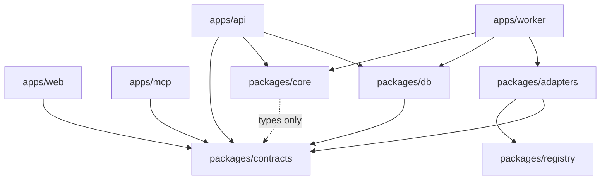
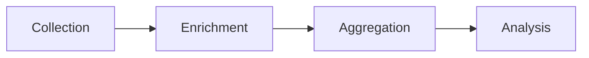

# Code Graph — Living Architecture Map

> **Purpose:** Navigate the system without opening every source file. Update this file in the same PR that adds a package, app, or `packages/core` algorithm.

**Spec source of truth:** [`BUILD_SPEC.md`](../BUILD_SPEC.md)  
**Canvas (visual):** open `platform-code-graph.canvas.tsx` beside chat

## Package dependency DAG

## Four pipelines

| Pipeline | Owner | Spec |
|---|---|---|
| Collection | `apps/worker` + `packages/adapters` | §6 |
| Enrichment | `packages/core` extraction | §7 |
| Aggregation | `packages/core` metrics + rollups | §8 |
| Analysis | actions / perception / shopping | §9–§11 |

## Module → responsibility

| Path | Responsibility | Spec |
|---|---|---|
| `packages/core/src/quota/` | Plans, credits, can* gates | §16.3 |
| `packages/core/src/extraction/` | Brand match, position, sentiment, URL normalize | §7 |
| `packages/core/src/metrics/` | Visibility, SoV, position, sentiment; query builder | §8 |
| `packages/core/src/insights/` | Performance matrix, strongest/weakest channel | §15.6 |
| `packages/core/src/actions/` | Rules R1–R10, opportunity scoring, bands | §9 |
| `packages/core/src/robots/` | RFC 9309 parse, crawlability, URL tester | §12.1 |
| `packages/core/src/agent/` | Access-log ingest + visited-URL join | §12.2 |
| `packages/core/src/perception/` | Market attributes, biggest gap, claim verdicts | §10 |
| `packages/core/src/shopping/` | Product match, SKU metrics, CSV, price drift | §11 |
| `packages/adapters/src/simulator/` | Deterministic zero-credential collection | §6.3 |
| `packages/adapters/src/api/` | OpenAI / Perplexity / Anthropic adapters | §6.4 |
| `packages/db/` | Seed + insights/views/actions + agent + perception + shopping | §5 |
| `packages/registry/` | Channels, bots, assistants, countries | §22 |
| `apps/api/` | REST + shopping/perception/agent + actions | §13, §16 |
| `apps/web/` | Dashboard + Shopping + Perception + Agent | §15 |
| `apps/worker/` | Multi-channel collect→enrich | §6–§9 |
| `apps/mcp/` | MCP tools | §14 |

## Normative choke points (do not fork)

1. `packages/core/src/metrics/` — one metric implementation for dashboard, API, MCP, CSV
2. `packages/core/src/quota/` — one quota enforcer for prompts/channels/API/MCP/BI
3. `packages/adapters` `EngineAdapter` interface — all engines
4. Authz query-builder chokepoint in `apps/api` — multi-tenant isolation

## Current scaffold status (Phase 0–11 + gap closure)

| Package / app | Status |
|---|---|
| `packages/core` | Extraction + metrics + actions + robots + agent + perception + shopping + **quota** |
| `packages/adapters` | Simulator + live/fixture per-provider API adapters |
| `packages/db` | Seed + PG extension + authz + reports + API keys + **commercial** |
| `packages/contracts` | Zod schemas + generated OpenAPI |
| `packages/registry` | Channels + AI bots + assistant referral hosts |
| `apps/api` | Customer API + OpenAPI + CSV/BI + MCP proxy + **quota/GDPR/billing** |
| `apps/web` | Shopping + Perception + Channels + **Billing** + **onboarding funnel** |
| `apps/worker` | BullMQ collect queue (+ inline fallback) |
| `apps/mcp` | `reports.brands` / projects / chats tools + slash commands |

**Gap closure (ADR 0004):** signup/Postgres projects hydrate Actions/Perception/Shopping via `project_extension` + `bootstrapProjectFeatures`; report routes require session membership (except `prj_demo`).

**Gap closure (ADR 0005):** BullMQ `geo-collect` when `REDIS_URL` set; inline `job_key` idempotent collect otherwise. API `POST /v1/projects/:id/collect`.

**Gap closure (ADR 0006):** Per-provider live adapters — keyed channels call real APIs; others stay on fixtures. `GET /v1/adapters/runtime` + Channels UI honesty.

**Phase 10 (ADR 0007):** `brandsReportPayload` shared by dashboard/API/MCP; API keys + OpenAPI + CSV/BI; parity test asserts identical visibility numbers.

**Phase 11 (ADR 0008):** `packages/core/quota` + commercial pause/pitch/audit/GDPR; write paths enforce quotas; report p95 check in API tests.

**Phase 11b:** Mock/Stripe-shaped checkout + webhook, SSO IdP config (enterprise), PG org/audit sync.

**Phase 12 (ADR 0009):** **Deferred** — no `ui` adapters; ship on simulator + official APIs only.

**Product polish (ADR 0010):** §15 shell (Peec-aligned grouped nav, filters, ⌘K), Overview default widgets, real Stripe when keyed, SAML metadata/ACS, API keys UI. Profile/Brands/Channels live under Settings; Agent & Shopping collapse by default.

**API-first Peec channels (ADR 0011):** Peec-like channel set routes by model family — GPT→OpenAI, Claude→Anthropic, Gemini/AI Mode/Overviews→Google, Perplexity→Sonar, Copilot→Azure OpenAI when keyed. Optional **`CURSOR_API_KEY`** fills channels missing native vendor keys (`GEO_COLLECTION_BACKEND=auto|cursor|native`). Brands CRUD + chats/brands CSV export + expanded MCP tools.

**Onboarding funnel:** Signup → `/onboarding/{project,profile,topics,prompts,results,plan}`. Project gains `location`; brand profile gains `description` / `identityTags` / `targetMarkets`. Shared topic/prompt steps under `apps/web/src/components/onboarding/`. `POST .../onboarding/complete` sets `CUSTOMER`; app shell gates `ONBOARDING` projects away from `/{projectId}/*` (except billing/settings). Plan picker uses Starter/Pro/Advanced display aliases for starter/growth/agency with monthly/yearly.

## Maintenance rule

When you add a package or move a module: update this file **and** the canvas in the same change.

