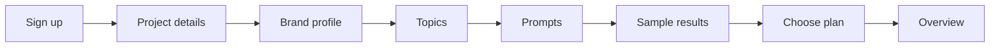
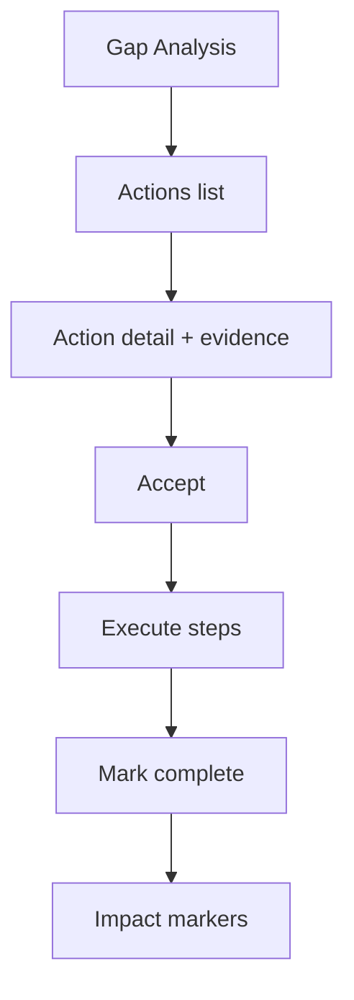

# GeoLens — Product Manual

**Word document (with journey images):** [`GeoLens_Product_Manual.docx`](GeoLens_Product_Manual.docx)  
**Image assets / rebuild script:** [`product-manual-assets/`](product-manual-assets/)

**Audience:** product, success, sales, and new users  
**Product:** GeoLens — AI search / GEO analytics  
**Related engineering docs:** [`BUILD_SPEC.md`](../BUILD_SPEC.md), [`CODE_GRAPH.md`](CODE_GRAPH.md)  
**Demo:** open `/prj_demo/overview` after local start, or sign up and use your first project  

This manual describes **what users can do**, **who they are**, and **how they move through the product**. It is written as customer-facing product documentation, grounded in the current app surface.

---

## 1. What GeoLens is

People increasingly ask AI assistants (“What’s the best CRM for a 20-person agency?”) instead of searching keywords. GeoLens measures that channel:

1. You define **prompts** (natural-language questions you want to be found for).
2. GeoLens runs them across **AI engines / model channels** (and countries).
3. Every answer becomes a **chat** — brands mentioned, order, sentiment, sources, citations, fanouts, ads, products.
4. Those chats roll up into **visibility, share of voice, position, sentiment**, plus source and shopping metrics.
5. Gaps turn into ranked **Actions**; Perception and Fact-checking show how AI *describes* you; Agent analytics show whether bots can crawl you and whether AI traffic converts.

**GeoLens is not:** a content writer, a classic SEO rank tracker, or an LLM observability tool. It recommends *what* to fix and *where* to show up; it does not write or publish content for you.

---

## 2. Core concepts (read once)

| Term | Meaning |
|------|---------|
| **Chat** | One prompt × one engine × one country × one day → one AI answer. Every metric drills back to chats. |
| **Prompt** | A conversational question you track (not a keyword). Has topic, tags, country, lifecycle (active / paused / archived). |
| **Model channel** | Stable surface ID (e.g. ChatGPT), independent of model version churn. Prefer filtering by channel, not raw model id. |
| **Source vs citation** | *Source* = URL retrieved while answering. *Citation* = URL shown in the answer. Optimize differently. |
| **Brand visibility vs source visibility** | Named in the answer vs your domain retrieved/cited. Diagnose “famous but uncited” vs “cited but unnamed.” |
| **Fanout** | Background search the model runs while answering. Reveals what it actually looked for. |
| **Gap** | A domain/URL that often appears for your prompts, names competitors, and never names you. Fuel for Actions. |
| **Surface kind** | `simulator` / `api` / `ui`. API data is honest but not identical to the consumer UI experience. |

---

## 3. Who uses GeoLens (personas)

### 3.1 Brand marketing lead — “Maya”

- **Goal:** Prove AI search is a channel; grow brand visibility and share of voice.
- **Typical org:** Mid-market SaaS / ecommerce brand on a **brand plan**.
- **Cares about:** Overview, Insights, Channels, Competitors, Actions, Impact, Perception.
- **Success:** Weekly visibility up on priority topics; actions completed with Impact markers.

### 3.2 Content / SEO / GEO specialist — “Jordan”

- **Goal:** Close source gaps; get cited on high-authority pages; fix crawl blocks.
- **Cares about:** Sources, Gap Analysis, Domains/URLs, Fanouts, Crawlability, Crawl Insights, Actions briefs.
- **Success:** Gap list shrinking; robots.txt allows AI bots; crawled URLs become citations.

### 3.3 Brand / product marketer — “Priya”

- **Goal:** Control narrative — attributes, objections, factual accuracy in AI answers.
- **Cares about:** Perception, Fact-checking, Brand profile, Chats (evidence).
- **Success:** Biggest perception gaps documented; contradicted claims fixed on-site and re-checked.

### 3.4 Ecommerce / merchandising — “Sam”

- **Goal:** SKU visibility and correct pricing in shopping-style AI answers.
- **Cares about:** Shopping catalog, win rate, price drift, demand queries.
- **Success:** Catalog matched; price drift alerts actioned; win rate up on hero SKUs.

### 3.5 Agency strategist — “Alex”

- **Goal:** Pitch and retain clients with multi-project visibility; allocate credits.
- **Cares about:** Multiple projects, pitch → customer conversion, Billing/credits, Share links, client-safe views.
- **Success:** Pitch project converts with history preserved; client viewers see reports without Actions strategy.

### 3.6 Technical / RevOps / platform — “Riley”

- **Goal:** Wire data into BI, agents, and SSO; keep quotas clean.
- **Cares about:** API keys, MCP, SSO/SAML, Billing quotas, auditability.
- **Success:** Dashboard = API = MCP numbers; SSO for enterprise users.

### 3.7 Executive / stakeholder — “Chris” (often read-only)

- **Goal:** High-level trend and competitive position without operating the tool daily.
- **Cares about:** Overview, shared views (`/share/...`), Impact narrative.
- **Success:** Shared link in board pack; no login required for read-only share.

---

## 4. Roles & access (RBAC)

Org and project roles control what each persona can do.

### Org roles

| Role | Can do |
|------|--------|
| **Owner** | Everything: billing, API keys, SSO, all writes (including API/MCP writes). |
| **Admin** | All projects; configuration; **no billing**. |
| **Member** | Read/write across projects; **sees Actions**. |
| **Guest** | Only projects explicitly granted. |

### Project roles (agency client seats)

| Role | Can do |
|------|--------|
| **Editor** | Edit that project’s config. |
| **Viewer** | Read-only reporting. |

**Important:** Actions (competitive strategy) are for org `owner` / `admin` / `member` — **not** project-only guests/viewers.

---

## 5. Application map (what exists where)

Use the left sidebar (Peec-aligned). Top bar: date range, channel/model filter, search (⌘K / Ctrl+K). Agent analytics, Shopping, and Settings start collapsed unless you are on that section.

| Area | Pages | User outcome |
|------|-------|--------------|
| **Home** | Overview | Visibility health vs competitors |
| **Brand** | Insights, Perception, Fact-checking | Where you win/lose; narrative & accuracy |
| **Prompts** | All prompts, Discovery | What you track and how coverage is built |
| **Sources** | Gap analysis, Domains, URLs | Citation / retrieval optimization |
| **Actions** | Actions, Impact | Prioritized work + measurement |
| **Results** | Chats, Fanouts, Ads | Evidence and ad landscape |
| **Agent analytics** | Crawlability, Crawl Insights, AI Referrals | Bot access + AI traffic |
| **Shopping** | Shopping | Catalog / SKU AI visibility |
| **Settings** | Profile, Brands, Competitors, Topics & tags, Channels, Billing, API keys, SSO | Project setup & commercial |

**Marketing / auth**

| Route | Purpose |
|-------|---------|
| `/` | Product story, demo CTA, feature showcase |
| `/signup` | Create account + first project; redirects to onboarding |
| `/onboarding/*` | Peec-style funnel: project → profile → topics → prompts → results → plan |
| `/login` | Session login |
| `/share/[viewId]` | Read-only shared Overview-style report |

---

## 6. End-to-end user journeys

### Journey A — First-time brand setup (Maya + Jordan)

**Goal:** From signup through the Peec-style onboarding funnel into a trusted Overview.

| Step | Where | What the user does |
|------|-------|--------------------|
| 1 | `/signup` | Create account (name, email, password; optional org). Redirects into onboarding — not Overview. |
| 2 | `/onboarding/project` | Brand URL, name, location, language, timezone. |
| 3 | `/onboarding/profile` | Description, industry, identity tags, products/services, target markets. Triggers discovery generate. |
| 4 | `/onboarding/topics` | Review / edit suggested topics (shared with in-app Discovery). |
| 5 | `/onboarding/prompts` | Select prompts and activate (API/simulator collection — not UI scraping). |
| 6 | `/onboarding/results` | Sample visibility teaser from project metrics / fixtures + collection honesty note. |
| 7 | `/onboarding/plan` | Monthly/yearly toggle; Starter / Pro / Advanced (maps to starter / growth / agency); start trial or upgrade. Completes onboarding (`status → CUSTOMER`). |
| 8 | Overview | KPI tiles, trend, chats — main app is gated until onboarding completes. |

Later adds still use in-app **Brand profile**, **Discovery**, and **Billing**. Demo project `prj_demo` is not gated.

**Definition of done:** Funnel completed; Visibility / SoV show numbers (or clear empty state after activation); opening a chat proves the pipeline when collection has run.

---

### Journey B — Weekly GEO operating rhythm (Jordan)

**Goal:** Continuous improvement loop.

| Cadence | Steps |
|---------|-------|
| **Monday** | Overview + Insights: which topics/channels moved? Filter last 7 days. |
| **Same day** | Gap Analysis: top domain/URL gaps → open Domains/URLs → bookmark priorities. |
| **Same day** | Actions → **Generate** (respect cooldown) → Accept top opportunities. |
| **Mid-week** | Execute briefs outside GeoLens (content/PR/partnerships). Mark steps complete. |
| **Friday** | Impact: check visibility sparkline + markers (directional, not causal). |
| **As needed** | Fanouts: adjust prompt wording to match what models actually search. |
| **As needed** | Crawlability: fix robots.txt blocks; retest path. |

---

### Journey C — Narrative & trust (Priya)

**Goal:** AI describes the brand accurately.

| Step | Where | What |
|------|-------|------|
| 1 | Perception | Read association vs market prominence; note **biggest gap** and strongest competitor attributes. |
| 2 | Perception | Review objections clusters and phrasings for messaging/FAQ work. |
| 3 | Fact-checking | **Contradicted** tab: claim vs your fact (e.g. wrong price). |
| 4 | Fact-checking | **By fact** / **By category**: which truths never appear vs which categories fail. |
| 5 | Chats | Open evidence chats behind bad claims. |
| 6 | Brand profile | Update products/tagline so future discovery and perception stay aligned. |
| 7 | Off-product | Fix website/docs; wait for next collection cycle; re-check Fact-checking. |

---

### Journey D — Close a competitive gap (Maya + Jordan)

**Goal:** Turn a Gap into a completed Action with Impact.

| Step | Detail |
|------|--------|
| Find | Gap Analysis shows domain/URL with high gap score and competitor names. |
| Prioritize | Actions table: opportunity score, group, evidence counts. |
| Decide | Open action: brief, why, competitor evidence, steps. Accept or decline. |
| Execute | Toggle steps as you finish external work. |
| Measure | Complete action → Impact chart shows marker near visibility series. |

---

### Journey E — Ecommerce shopping visibility (Sam)

| Step | Where | What |
|------|-------|------|
| 1 | Shopping | Upload / ingest CSV catalog. |
| 2 | Shopping | Review product visibility, win rate, position, **price drift**. |
| 3 | Shopping | Filter all products vs catalog-matched. |
| 4 | Shopping | Inspect shopping queries / demand. |
| 5 | Fact-checking / Chats | Confirm wrong prices as contradicted claims if present. |
| 6 | Actions / content | Fix feed/PDP; re-ingest; watch win rate and drift. |

---

### Journey F — Agency pitch → retained client (Alex)

| Step | What |
|------|------|
| 1 | Create **pitch** project with limited prompt allowance. |
| 2 | Seed brand profile + discovery for prospect domain. |
| 3 | Run collection (simulator or live APIs). |
| 4 | Build narrative: Overview + Insights + one strong Action. |
| 5 | Share read-only link with prospect (no Actions strategy leak if they are viewers). |
| 6 | On win: convert pitch → customer **in place** (history preserved). |
| 7 | Allocate credits across projects; invite client as project **viewer**. |
| 8 | Billing: monitor usage vs limits; pause only with eyes open (paused period data is lost). |

---

### Journey G — Platform integration (Riley)

| Step | Where | What |
|------|-------|------|
| 1 | API keys | Create key (shown once); scopes for `/customer/v1/*` with `x-api-key`. |
| 2 | External tools | Pull same metrics as dashboard (parity is a product promise). |
| 3 | MCP | Connect assistants/tools that call GeoLens MCP (same authz as user). |
| 4 | SSO | Enterprise: configure IdP; test redirect; distribute SP metadata. |
| 5 | Billing | Confirm plan gates (API, MCP, SSO, quotas). |
| 6 | Crawl Insights | Connect Cloudflare / upload sample logs for bot visit joins. |
| 7 | AI Referrals | Connect GA4-style referral reporting (floor, not total). |

---

### Journey H — Executive check-in (Chris)

| Step | What |
|------|------|
| 1 | Opens shared link — no login. |
| 2 | Reads own-brand KPIs and brand comparison table. |
| 3 | Asks Maya one question: “What are we doing about the gap?” → Maya uses Actions/Impact, not the share link. |

---

## 7. Feature manual (by module)

### 7.1 Overview

**You can:** see headline brand metrics, trend/rank visuals, recent chats, top actions, top domains; share a view; jump via ⌘K.

**Use when:** daily pulse or stakeholder screenshot.

**Tips:** Always verify surprises in **Chats**. Date range and channel filters change the story.

---

### 7.2 Brand Insights

**You can:** inspect topic × channel performance (e.g. heatmap of visibility); spot strongest/weakest channel.

**Use when:** “We win on ChatGPT but lose on Perplexity for topic X.”

---

### 7.3 Channels

**You can:** see per-engine health, visibility, chat volume, surface kind, collection mode / API key status, geo capability.

**Use when:** diagnosing empty metrics or adapter honesty (simulator vs live API).

---

### 7.4 Brand profile

**You can:** edit identity fields and mark reviewed. Profile seeds Discovery, competitors, and Perception industry context.

---

### 7.5 Competitors

**You can:** accept/reject suggested brands from chat mentions. Tracking competitors changes competitive context (position includes untracked brands too — adding competitors does not “hide” others from rank math).

---

### 7.6 Perception

**You can:** read market attributes (association vs prominence), objections, headline cards (most associated, best vs competitors, biggest gap, strongest competitor).

**Use when:** messaging, positioning, competitive narrative.

---

### 7.7 Fact-checking

**You can:** switch **Contradicted / By fact / By category**; see claims from AI chats judged against your asserted facts.

**Use when:** pricing, feature claims, or policy statements are wrong in AI answers.

---

### 7.8 Prompts, Topics, Discovery

| Capability | Detail |
|------------|--------|
| **All prompts** | Create, edit text, activate / pause / archive; set country. |
| **Topics & tags** | Organize coverage; system + custom tags; CSV bulk import. |
| **Discovery** | Guided wizard with coverage report and volume scores (volume may be labeled beta/offline). |

**Quota:** activating prompts × channels × frequency consumes **allocation** (credits on agency plans). Limits show on Billing.

---

### 7.9 Sources & Gap Analysis

| Page | You can |
|------|---------|
| **Domains** | Metrics, classify (OWN / COMPETITOR / …), bookmark, filter gaps / bookmarked. |
| **URLs** | Page-level metrics, bookmark, open detail. |
| **URL detail** | Single-URL KPIs (`?u=`). |
| **Gap Analysis** | Ranked domains/URLs naming competitors but not you, with guidance. |

---

### 7.10 Actions & Impact

| Capability | Detail |
|------------|--------|
| **Generate** | Produce opportunity-scored recommendations from rules + evidence (cooldown). |
| **Lifecycle** | Accept / decline / complete / cancel; toggle steps. |
| **Evidence** | Every action should cite the chats/sources that produced it. |
| **Impact** | Visibility over time with action markers — **not** causal attribution. |

---

### 7.11 Chats, Fanouts, Ads

| Page | You can |
|------|---------|
| **Chats** | Browse atomic runs; open full answer, mentions, sources. |
| **Fanouts** | See background queries, common terms, channel breakdown. |
| **Ads** | Advertisers and creatives in AI answers (when present in window). |

---

### 7.12 Agent analytics

| Page | You can |
|------|---------|
| **Crawlability** | robots.txt vs AI bots; path tester; blocked-bot warnings. |
| **Crawl Insights** | Bot visits joined to retrieval/citation; connect ingest / CSV sample. |
| **AI Referrals** | Sessions / conversions / revenue by assistant — labeled as a floor, not total. |

---

### 7.13 Shopping

**You can:** ingest catalog (CSV), view SKU visibility / win rate / position / price drift, inspect shopping queries.

---

### 7.14 Billing, API keys, SSO

| Page | You can |
|------|---------|
| **Billing** | See plan & usage vs limits; upgrade (mock or Stripe); pause/unpause with data-loss warning; SSO fields when entitled. |
| **API keys** | Create (once), list, revoke. |
| **SSO** | Enterprise IdP config, test login, SP metadata. |

---

### 7.15 Global UX

- **Filters:** date range (7d / 30d / 90d) and model/channel (persisted). Project / All tags chips may be visual placeholders depending on build.
- **⌘K:** jump to any sidebar destination.
- **Share:** read-only public view for Overview-style KPIs.

---

## 8. Persona → primary screens cheat sheet

| Persona | Start here | Deep work | Prove value |
|---------|------------|-----------|-------------|
| Maya (brand lead) | Overview | Insights, Actions | Impact, Share |
| Jordan (GEO/SEO) | Gaps | Domains/URLs, Fanouts, Crawlability | Actions complete |
| Priya (brand) | Perception | Fact-checking, Chats | Cleared contradictions |
| Sam (ecom) | Shopping | Price drift, catalog | Win rate |
| Alex (agency) | Project switch / Billing | Pitch Discovery | Shared client view |
| Riley (platform) | API keys / SSO | MCP, Crawl ingest | Parity checks |
| Chris (exec) | Share link | — | Ask for Impact story |

---

## 9. Recommended first 30 days

| Days | Focus |
|------|-------|
| **1–3** | Profile, competitors, Discovery, activate balanced prompt set, confirm Channels collecting. |
| **4–7** | Live with Overview + Chats; fix any crawl blocks; bookmark top gaps. |
| **8–14** | First Actions cycle; Perception + Fact-checking pass; Shopping catalog if ecom. |
| **15–21** | Execute accepted actions; Fanouts refine prompts; Share first stakeholder link. |
| **22–30** | Impact review; API/MCP if needed; Billing quota hygiene; expand countries/channels only if allocation allows. |

---

## 10. Metrics glossary (customer-facing)

| Metric | Plain language |
|--------|----------------|
| **Visibility** | How often your brand is named in answers (among eligible chats). |
| **Share of voice (SoV)** | Your mention share vs other brands in those answers. |
| **Position** | Average rank among *all* brands named (including untracked). |
| **Sentiment** | How positively you are described when named. |
| **Retrieval / citation** | Your pages found vs explicitly cited. |
| **Gap score** | How often a source helps competitors and not you. |
| **Win rate (Shopping)** | How often your SKU wins vs alternatives in shopping answers. |
| **Price drift** | AI-stated price diverges from your catalog. |

Formulas are normative in engineering `BUILD_SPEC.md` §8 — dashboard, API, and MCP must match.

---

## 11. Plans, credits, and pausing (commercial)

- **Brand plans:** gate prompts, channels, projects, countries, frequency, and features (API, MCP, SSO, BI).
- **Agency plans:** **credits** = allocation slots from prompts × models × run days — not a monthly “spend wallet.”
- **Pitch projects:** smaller allowance for prospecting; convert to customer without losing history.
- **Pause:** stops collection and frees allocation; **data for the paused period is not recoverable** — confirm carefully.

Exact limits appear on **Billing**.

---

## 12. Integrations summary

| Surface | Who | Purpose |
|---------|-----|---------|
| **Web dashboard** | All personas | Primary UX |
| **Share links** | Execs / clients | Read-only KPIs |
| **Customer REST API** | Riley | Automation, BI, custom apps |
| **MCP** | Riley / power users | Assistants querying GeoLens data |
| **CSV** | Jordan / Sam | Prompt import, shopping catalog, log samples |
| **SAML SSO** | Enterprise | Corporate login |
| **Cloudflare / GA-style** | Riley / Jordan | Crawl Insights & AI Referrals |

---

## 13. Honesty & limitations (tell customers)

1. **Simulator / API / UI surfaces differ.** Label collection mode in Channels; do not sell API numbers as “exact ChatGPT UI.”
2. **Impact is correlational.** Markers show when you worked; they do not prove causation.
3. **AI Referrals are a floor.** Not all assistant traffic is measurable in analytics.
4. **Position includes untracked brands.** Rank can change when the market names someone new — by design.
5. **Some UI affordances** (e.g. Overview Export, Brands full CRUD, Project/tags filter chips) may be incomplete in a given build — prefer Chats and API for verification when unsure.

---

## 14. Demo & training path

1. Marketing home → **Open demo** → `/prj_demo/overview`.
2. Walk Overview → Insights → Channels.
3. Open one Chat (prove atomic unit).
4. Gap Analysis → one Action detail → Impact.
5. Perception → Fact-checking.
6. Crawlability → Shopping (if relevant).
7. Settings: Billing quotas story; API keys for technical buyers.

Seeded demo narratives (engineering seed) typically include: competitor overtaking mid-window, a weak channel, a dominant Reddit citation, robots.txt bot block, contradicted price claim, shopping price drift — use these as teaching stories.

---

## 15. Document control

| Field | Value |
|-------|-------|
| Title | GeoLens Product Manual |
| Location | `docs/PRODUCT_MANUAL.md` |
| Complements | Build Spec (engineering), Code Graph (architecture) |
| Update when | Nav modules change, new personas ship, or commercial gates change |

**Maintainer note:** When adding a sidebar module, update §5 and §7 in the same PR, and add a row to the relevant journey in §6.
